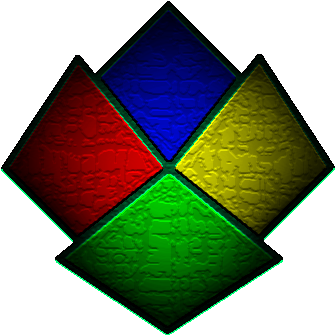

<!--
*** Thanks for checking out the Best-README-Template. If you have a suggestion
*** that would make this better, please fork the repo and create a pull request
*** or simply open an issue with the tag "enhancement".
*** Thanks again! Now go create something AMAZING! :D
***
***
***
*** To avoid retyping too much info. Do a search and replace for the following:
*** IzaacJ, electron-react-typescript-antd, izaacj, izaac.brann@outlook.com, ERTa, Electron-React-TypeScript-antd
-->


<!-- PROJECT SHIELDS -->
<!--
*** I'm using markdown "reference style" links for readability.
*** Reference links are enclosed in brackets [ ] instead of parentheses ( ).
*** See the bottom of this document for the declaration of the reference variables
*** for contributors-url, forks-url, etc. This is an optional, concise syntax you may use.
*** https://www.markdownguide.org/basic-syntax/#reference-style-links
-->
[![Contributors][contributors-shield]][contributors-url]
[![Forks][forks-shield]][forks-url]
[![Stargazers][stars-shield]][stars-url]
[![Issues][issues-shield]][issues-url]
[![MIT License][license-shield]][license-url]
[![LinkedIn][linkedin-shield]][linkedin-url]


<!-- PROJECT LOGO -->
<br />
<p align="center">
  <a href="https://github.com/IzaacJ/electron-react-typescript-antd">
    
  </a>

  <h3 align="center">ERTa</h3>

  <p align="center">
    Electron-React-TypeScript-antd
    <br />
    <a href="https://github.com/IzaacJ/electron-react-typescript-antd"><strong>Explore the docs »</strong></a>
    <br />
    <br />
    <a href="https://github.com/IzaacJ/electron-react-typescript-antd">View Demo</a>
    ·
    <a href="https://github.com/IzaacJ/electron-react-typescript-antd/issues">Report Bug</a>
    ·
    <a href="https://github.com/IzaacJ/electron-react-typescript-antd/issues">Request Feature</a>
  </p>
</p>


<!-- TABLE OF CONTENTS -->
<details open="open">
  <summary><h2 style="display: inline-block">Table of Contents</h2></summary>
  <ol>
    <li>
      <a href="#about-the-project">About The Project</a>
      <ul>
        <li><a href="#built-with">Built With</a></li>
      </ul>
    </li>
    <li>
      <a href="#getting-started">Getting Started</a>
      <ul>
        <li><a href="#prerequisites">Prerequisites</a></li>
        <li><a href="#installation">Installation</a></li>
      </ul>
    </li>
    <li><a href="#usage">Usage</a></li>
    <li><a href="#roadmap">Roadmap</a></li>
    <li><a href="#contributing">Contributing</a></li>
    <li><a href="#license">License</a></li>
    <li><a href="#contact">Contact</a></li>
    <li><a href="#acknowledgements">Acknowledgements</a></li>
  </ol>
</details>


<!-- ABOUT THE PROJECT -->
## About The Project

[![Product Name Screen Shot][product-screenshot]](https://github.com/IzaacJ/electron-react-typescript-antd)

This boilerplate is actively developed as the starting point for Electron apps I build.


### Built With

* [Electron](https://electronjs.org)
* [React](https://reactjs.org)
* [antd](https://ant.design)
* [Webpack](https://webpack.js.org)


<!-- GETTING STARTED -->
## Getting Started

To get a local copy up and running follow these simple steps.

### Prerequisites

* yarn
  * Linux
    ```sh
    npm install yarn -g
    ```
  * Windows (using [Chocolatey](https://chocolatey.org/install#individual))
    ```ps
    choco install yarn
    ```

### Installation

1. Clone the repo
   ```sh
   git clone https://github.com/IzaacJ/electron-react-typescript-antd.git
   ```
1. Change into the project directory
   ```sh
   cd electron-react-typescript-antd
   ```
1. Install project dependencies
   ```sh
   yarn install
   ```
1. Run the development version
   ```sh
   yarn dev
   ```


<!-- USAGE EXAMPLES -->
## Usage

* ### File Structure
  > *This section still needs information*


<!-- ROADMAP -->
## Roadmap

See the [open issues](https://github.com/IzaacJ/electron-react-typescript-antd/issues) for a list of proposed features (and known issues).


<!-- CONTRIBUTING -->
## Contributing

Contributions are what make the open source community such an amazing place to be learn, inspire, and create. Any contributions you make are **greatly appreciated**.

1. Fork the Project
2. Create your Feature Branch (`git checkout -b feature/AmazingFeature`)
3. Commit your Changes (`git commit -m 'Add some AmazingFeature'`)
4. Push to the Branch (`git push origin feature/AmazingFeature`)
5. Open a Pull Request


<!-- LICENSE -->
## License

Distributed under the MIT License. See [`LICENSE`][license-url] for more information.


<!-- CONTACT -->
## Contact

Izaac Brånn - [@izaacj](https://twitter.com/izaacj) - izaac.brann@outlook.com

Project Link: [https://github.com/IzaacJ/electron-react-typescript-antd](https://github.com/IzaacJ/electron-react-typescript-antd)


<!-- ACKNOWLEDGEMENTS -->
## Acknowledgements

* [Electron](https://electronjs.org)
* [React](https://reactjs.org)
* [antd](https://ant.design)
* [Webpack](https://webpack.js.org)


<!-- MARKDOWN LINKS & IMAGES -->
<!-- https://www.markdownguide.org/basic-syntax/#reference-style-links -->
[contributors-shield]: https://img.shields.io/github/contributors/IzaacJ/repo.svg?style=for-the-badge
[contributors-url]: https://github.com/IzaacJ/repo/graphs/contributors
[forks-shield]: https://img.shields.io/github/forks/IzaacJ/repo.svg?style=for-the-badge
[forks-url]: https://github.com/IzaacJ/repo/network/members
[stars-shield]: https://img.shields.io/github/stars/IzaacJ/repo.svg?style=for-the-badge
[stars-url]: https://github.com/IzaacJ/repo/stargazers
[issues-shield]: https://img.shields.io/github/issues/IzaacJ/repo.svg?style=for-the-badge
[issues-url]: https://github.com/IzaacJ/repo/issues
[license-shield]: https://img.shields.io/github/license/IzaacJ/repo.svg?style=for-the-badge
[license-url]: https://github.com/IzaacJ/repo/blob/main/LICENSE.md
[linkedin-shield]: https://img.shields.io/badge/-LinkedIn-black.svg?style=for-the-badge&logo=linkedin&colorB=555
[linkedin-url]: https://linkedin.com/in/izaacbrann
[product-screenshot]: images/screenshot.png